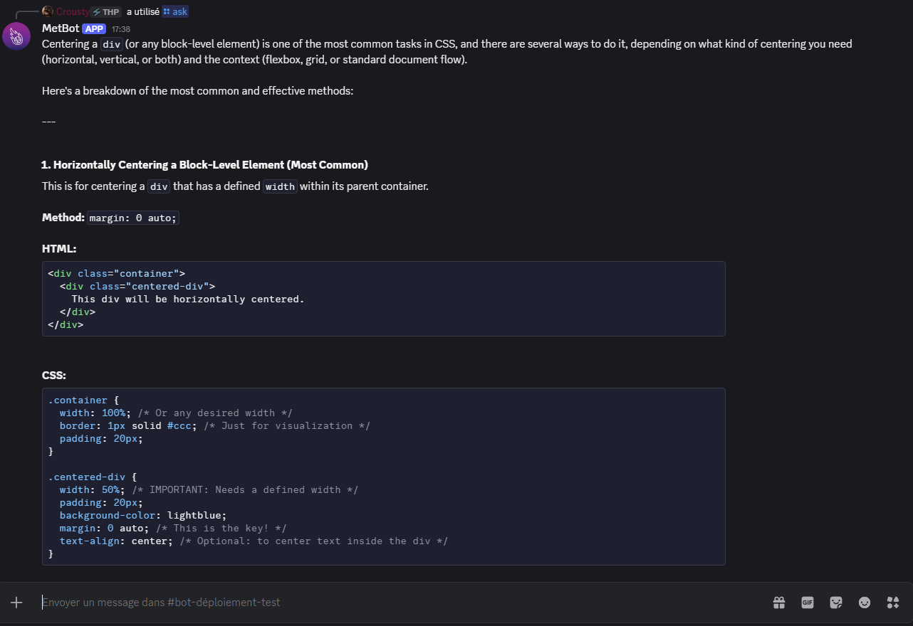
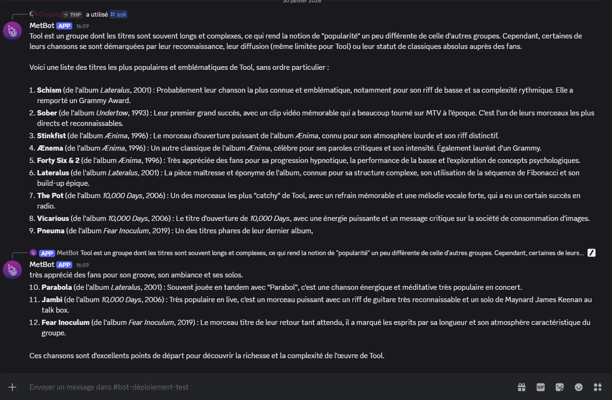

# 🤖 Discord Bot with Google Gemini Integration

A powerful Discord bot that leverages Google's Gemini AI to provide intelligent responses directly within Discord servers. This bot seamlessly integrates with the Discord API and Gemini's advanced language models to deliver an interactive AI assistant experience.

## ✨ Features

- **AI-Powered Responses**: Uses Google Gemini 2.5 Flash to generate intelligent, context-aware responses
- **Slash Commands**: Modern Discord slash command interface for intuitive user interaction
- **Message Chunking**: Automatically splits long responses to comply with Discord's 2000 character limit
- **Error Handling**: Robust error management with user-friendly feedback
- **Environment Configuration**: Secure credential management through environment variables
- **Multi-Server Support**: Can be deployed across multiple Discord servers

## 🚀 Prerequisites

Before you begin, ensure you have the following:

- **Node.js** (v14 or higher)
- **npm** (Node Package Manager)
- **Discord Server** (with administrator privileges)
- **Discord Bot Token** (from [Discord Developer Portal](https://discord.com/developers/applications))
- **Google Gemini API Key** (from [Google AI Studio](https://aistudio.google.com/app/apikey))

## 📦 Installation

### 1. Clone the Repository
```bash
git clone https://github.com/crousty24-bit/botApp-Discord-Gemini.git
cd botApp-Discord-Gemini
```

### 2. Install Dependencies
```bash
npm install
```

### 3. Configure Environment Variables

Create a `.env` file in the root directory with the following variables:

```env
# Discord Configuration
DISCORD_BOT_TOKEN=your_discord_bot_token_here
DISCORD_BOT_API_ID=your_bot_application_id_here
SERVER_GUILD_ID=your_discord_server_id_here

# Google Gemini API
GEMINI_API_KEY=your_gemini_api_key_here
```

### 4. Register Slash Commands

Before running the bot, register the slash commands on your Discord server:

```bash
node src/registerCommands.js
```

### 5. Start the Bot

```bash
node src/index.js
```

You should see a confirmation message:
```
🤖 Bot connecté en tant que YourBotName#0000
```

## 📁 Project Structure

```
botApp-Discord-Gemini/
├── src/
│   ├── index.js              # Main bot entry point and interaction handler
│   ├── gemini.js             # Google Gemini API integration and responses
│   ├── registerCommands.js   # Slash command registration
│   └── webhook.js            # Discord webhook communication (optional)
├── package.json              # Project dependencies and metadata
├── .env                       # Environment variables (create this file)
└── README.md                  # This file
```

### File Descriptions

| File | Purpose |
|------|---------|
| `src/index.js` | Core bot logic - listens for interactions and routes commands to appropriate handlers |
| `src/gemini.js` | Handles API communication with Google Gemini and response generation |
| `src/registerCommands.js` | Registers the `/ask` slash command with Discord servers |
| `src/webhook.js` | Additional webhook functionality for extended Discord integration |

## 🎯 Usage

### Ask the Bot a Question

Use the `/ask` slash command in any Discord channel where the bot has permissions:

```
/ask What is the capital of France?
```

The bot will:
1. Acknowledge the command with a deferred reply
2. Send your prompt to Google Gemini API
3. Retrieve and format the response
4. Display the response in Discord, splitting it into multiple messages if necessary

### Example Interactions

- `/ask How do I learn Python?` → Receives comprehensive learning guide
- `/ask Explain quantum computing` → Gets detailed scientific explanation
- `/ask Write a short poem about coding` → Receives creative content

## ⚙️ Technical Details

### Technologies Used

- **discord.js** (v14.25.1) - Discord API wrapper for JavaScript/Node.js
- **dotenv** (v17.2.3) - Environment variable management
- **Google Gemini API** - Advanced language model for AI responses

### How It Works

1. **Initialization**: Bot connects to Discord using your bot token
2. **Command Registration**: Slash commands are registered to your guild
3. **Interaction Handling**: Bot listens for command interactions
4. **AI Processing**: Prompts are sent to Gemini API for processing
5. **Response Management**: Responses are formatted and split if needed
6. **Error Handling**: Errors are caught and reported to users

## 🔒 Security Considerations

- **Never commit `.env` file** to version control - it contains sensitive credentials
- **Keep API keys private** - regenerate keys if they're accidentally exposed
- **Use environment variables** for all sensitive configuration
- **Validate user input** to prevent prompt injection attacks
- **Implement rate limiting** for production deployments

## 🐛 Troubleshooting

### Bot doesn't respond
- Verify the bot has message permissions in the channel
- Check that all environment variables are correctly set
- Ensure the bot token is valid and not expired
- Confirm slash commands are registered with `node src/registerCommands.js`

### API Key errors
- Verify `GEMINI_API_KEY` is correct and has access
- Check Google Cloud project has Gemini API enabled
- Ensure the API key has proper permissions

### Discord connection issues
- Validate `DISCORD_BOT_TOKEN` is active
- Check that `DISCORD_BOT_API_ID` matches your bot application
- Verify `SERVER_GUILD_ID` is the correct Discord server ID

## 🚀 Deployment

For production deployment:

1. Use a process manager like **PM2** or **Forever**
2. Implement logging to monitor bot performance
3. Add rate limiting to prevent API abuse
4. Use a `.env` file or secrets management service
5. Monitor API usage to manage costs

### PM2 Example

```bash
npm install -g pm2
pm2 start src/index.js --name "discord-bot"
pm2 save
pm2 startup
```

## 📚 API Documentation

- [Discord.js Documentation](https://discord.js.org/)
- [Google Gemini API](https://ai.google.dev/)
- [Discord Developer Portal](https://discord.com/developers/applications)

## 📝 License

This project is licensed under the ISC License - see the `package.json` file for details.

## 🤝 Contributing

Contributions are welcome! Please feel free to:
- Report bugs and issues
- Suggest new features
- Submit pull requests
- Improve documentation

## 📧 Support

For issues, questions, or suggestions:
- Open an issue on [GitHub Issues](https://github.com/crousty24-bit/botApp-Discord-Gemini/issues)
- Check existing issues before creating a new one

## 🖼️ Examples

### Screenshots

Add screenshots of your bot in action:

- **Command Interaction**: 
- **AI Response**: 
- **Multi-part Response**: 

### Sample Use Cases

- **Educational Assistant**: Students asking homework questions
- **Coding Helper**: Developers getting coding advice and snippets
- **Creative Writing**: Community members requesting story ideas
- **Research Support**: Quick information lookups for server discussions

---

**Last Updated**: January 2026  
**Project Version**: 1.0.0